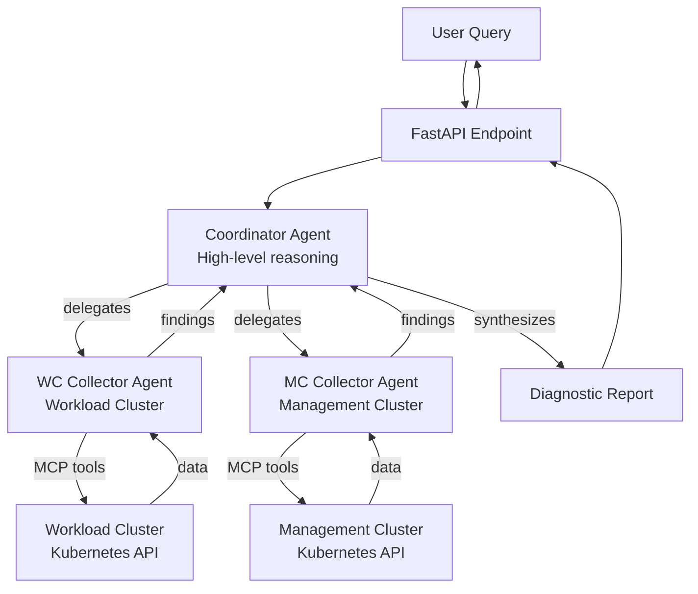

# Shoot

Kubernetes multi-agent system that helps:

- **Automates investigation**: Transforms high-level failure signals into targeted diagnostic reports
- **Coordinates multi-cluster debugging**: Seamlessly queries both workload and management clusters
- **Optimizes cost and speed**: Uses powerful reasoning only for coordination, simpler models for data collection
- **Provides structured output**: Returns concise, actionable diagnostic reports instead of raw data dumps

# Architecture

Multi-agent system for Kubernetes E2E debugging:

The system is workload-cluster-first: runtime evidence is gathered from the workload cluster; the management cluster is used only for App/HelmRelease deployment status and Cluster API (CAPI) object status.

- **Coordinator Agent**: Orchestrates investigation, synthesizes findings from collectors, generates diagnostic reports. Uses a powerful reasoning model (configurable via `OPENAI_COORDINATOR_MODEL`).
- **WC Collector Agent**: Collects diagnostic data from the workload cluster via Kubernetes MCP server (`workload_cluster_*` tools).
- **MC Collector Agent**: Collects diagnostic data from the management cluster via Kubernetes MCP server (`management_cluster_*` tools).

# Call the AI endpoint

You can test the Agent by opening a terminal and:
`curl 127.0.0.1:8000/ --data '{"query": "list namespaces"}'`
