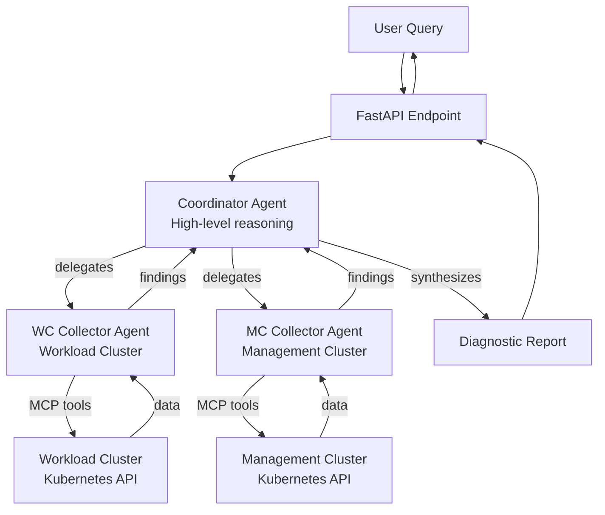

# Shoot

Kubernetes multi-agent system that helps:

- **Automates investigation**: Transforms high-level failure signals into targeted diagnostic reports
- **Coordinates multi-cluster debugging**: Seamlessly queries both workload and management clusters
- **Optimizes cost and speed**: Uses powerful reasoning only for coordination, simpler models for data collection
- **Provides structured output**: Returns concise, actionable diagnostic reports instead of raw data dumps

# Architecture

Multi-agent system for Kubernetes E2E debugging:

The system is workload-cluster-first: runtime evidence is gathered from the workload cluster; the management cluster is used only for App/HelmRelease deployment status and Cluster API (CAPI) object status.

- **Coordinator Agent**: Orchestrates investigation, synthesizes findings from collectors, generates diagnostic reports. Uses a powerful reasoning model (configurable via `OPENAI_COORDINATOR_MODEL`).
- **WC Collector Agent**: Collects diagnostic data from the workload cluster via Kubernetes MCP server (`workload_cluster_*` tools).
- **MC Collector Agent**: Collects diagnostic data from the management cluster via Kubernetes MCP server (`management_cluster_*` tools).



# Local Development

## Prerequisites

- [Anthropic API key](https://console.anthropic.com/)
- Access to Kubernetes clusters via [Teleport](https://goteleport.com/) (`tsh` CLI)
- Docker (for containerized setup) or Python 3.11+ with [uv](https://github.com/astral-sh/uv) (for native setup)

## Quick Start

### 1. Initial Setup

Create the local configuration directory and templates:

```bash
make -f Makefile.local.mk local-setup
```

This creates `local_config/` with a `.env` template.

### 2. Configure Environment

Edit `local_config/.env` and add your Anthropic API key:

```bash
ANTHROPIC_API_KEY=sk-ant-your-key-here
```

Optional configuration:
```bash
# Model selection (defaults shown)
ANTHROPIC_COORDINATOR_MODEL=claude-sonnet-4-5-20250929
ANTHROPIC_COLLECTOR_MODEL=claude-3-5-haiku-20241022

# Cluster context for prompts
WC_CLUSTER=my-workload-cluster
ORG_NS=org-myorg
```

### 3. Login to Kubernetes Clusters

Use Teleport to create kubeconfigs:

```bash
# For separate management and workload clusters:
make -f Makefile.local.mk local-kubeconfig MC=<management-cluster> WC=<workload-cluster>

# Or use the same cluster for both:
make -f Makefile.local.mk local-kubeconfig MC=<cluster-name>
```

This creates:
- `local_config/mc-kubeconfig.yaml` (management cluster)
- `local_config/wc-kubeconfig.yaml` (workload cluster)

## Running Locally

### Option A: Docker (Recommended - Matches Production)

Build and run with Docker:

```bash
# Build the image
make -f Makefile.local.mk docker-build

# Run the container
make -f Makefile.local.mk docker-run
```

The API will be available at `http://localhost:8000`

### Option B: Native Python (Faster Iteration)

Download the MCP Kubernetes binary:

```bash
make -f Makefile.local.mk local-mcp
```

Run with uvicorn (automatically creates virtualenv and installs dependencies):

```bash
make -f Makefile.local.mk local-run
```

The API will be available at `http://localhost:8000` with hot-reload enabled.

## Testing the Setup

### Health Check

```bash
# Basic health check
curl http://localhost:8000/health

# Deep check (validates configuration, kubeconfig, API key, MCP binary)
curl http://localhost:8000/ready?deep=true
```

### Send a Query

Using the convenience command:

```bash
# Default query (lists namespaces)
make -f Makefile.local.mk local-query

# Custom query
make -f Makefile.local.mk local-query Q="Check pod status in kube-system"
make -f Makefile.local.mk local-query Q="Investigate non-ready deployments"
```

Or using curl directly:

```bash
curl http://localhost:8000/ -d '{"query": "Investigate non-ready deployments"}'
```

### Streaming Response

```bash
curl -N http://localhost:8000/stream -d '{"query": "List all pods in default namespace"}'
```

## API Endpoints

- `GET /health` - Basic health check
- `GET /ready` - Readiness check (optional `?deep=true` for configuration validation)
- `GET /schema` - Returns the DiagnosticReport JSON schema
- `POST /` - Blocking query endpoint (returns complete response)
- `POST /stream` - Streaming query endpoint (returns chunks as they're generated)

### Request Format

```json
{
  "query": "Your diagnostic query here",
  "timeout_seconds": 300,  // optional, default 300
  "max_turns": 15          // optional, default 15
}
```

### Response Format

```json
{
  "result": "Diagnostic report text...",
  "request_id": "uuid-here"
}
```

## Development Workflow

```bash
# Install pre-commit hooks for code quality
pre-commit install

# Run code quality checks
pre-commit run --all-files

# Individual checks
black src/                    # Format code
flake8 src/                   # Lint
mypy src/                     # Type checking
bandit -c .bandit src/        # Security scan
```

## Troubleshooting

**"Claude Code not found" error:**
- For native Python setup, download the MCP binary: `make -f Makefile.local.mk local-mcp`
- Ensure `MCP_KUBERNETES_PATH` points to the correct binary location

**"model: claude-sonnet-4-5-20250514" not found:**
- Update your model configuration to use valid model IDs (see `.env.example`)
- Latest valid models: `claude-sonnet-4-5-20250929`, `claude-3-5-haiku-20241022`

**Authentication errors:**
- Verify your `ANTHROPIC_API_KEY` is valid
- Refresh cluster kubeconfigs: `make -f Makefile.local.mk local-kubeconfig MC=<cluster>`

For more detailed development guidance, see [CLAUDE.md](CLAUDE.md).
