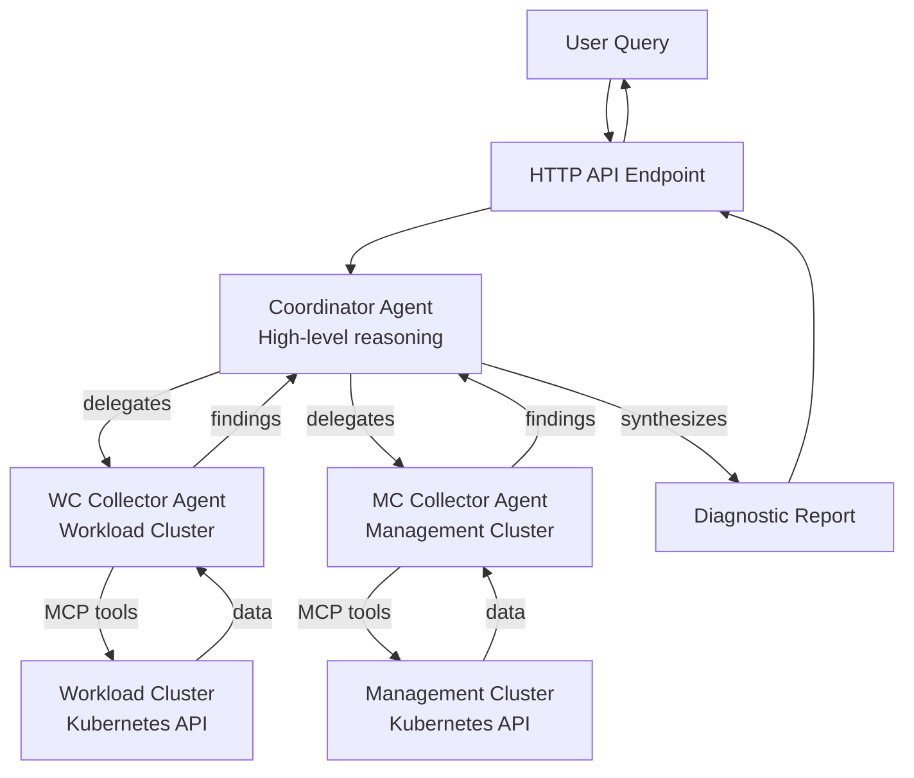

# Shoot

Kubernetes multi-agent system that helps:

- **Automates investigation**: Transforms high-level failure signals into targeted diagnostic reports
- **Coordinates multi-cluster debugging**: Seamlessly queries both workload and management clusters
- **Optimizes cost and speed**: Uses powerful reasoning only for coordination, simpler models for data collection
- **Provides structured output**: Returns concise, actionable diagnostic reports instead of raw data dumps

## Architecture

Multi-agent system for Kubernetes E2E debugging:

The system is workload-cluster-first: runtime evidence is gathered from the workload cluster; the management cluster is used only for App/HelmRelease deployment status and Cluster API (CAPI) object status.

- **Coordinator Agent**: Orchestrates investigation, synthesizes findings from collectors, generates diagnostic reports. Uses a powerful reasoning model (configurable via `OPENAI_COORDINATOR_MODEL`).
- **WC Collector Agent**: Collects diagnostic data from the workload cluster via Kubernetes MCP server.
- **MC Collector Agent**: Collects diagnostic data from the management cluster via Kubernetes MCP server.



## Technology Stack

This project uses:
- **[Google ADK (Agent Development Kit)](https://google.github.io/adk-docs/)** - Agent framework with MCP support
- **[OpenAI Models](https://platform.openai.com/docs/models)** - LLM inference via custom ADK adapter
- **[Model Context Protocol (MCP)](https://modelcontextprotocol.io/)** - Kubernetes cluster integration
- **[OpenTelemetry](https://opentelemetry.io/)** - Observability and tracing

## Prerequisites

- **Go**: 1.24 or later
- **mcp-kubernetes**: The MCP server binary for Kubernetes access
- **OpenAI API Key**: For model access

## Environment Variables

| Variable | Description | Required | Default |
|----------|-------------|----------|---------|
| `OPENAI_API_KEY` | OpenAI API key | Yes | - |
| `OPENAI_COORDINATOR_MODEL` | Model for coordinator agent (e.g., `o1-2024-12-17`) | Yes | - |
| `OPENAI_COLLECTOR_MODEL` | Model for collector agents | No | `gpt-4o-mini` |
| `WC_CLUSTER` | Workload cluster name | No | `workload cluster` |
| `ORG_NS` | Organization namespace | No | `organization namespace` |
| `DEBUG` | Enable debug logging (`true`, `1`, or `yes`) | No | `false` |
| `SERVER_PORT` | HTTP server port | No | `8000` |
| `OTEL_EXPORTER_OTLP_ENDPOINT` | OpenTelemetry endpoint | No | - |
| `OTEL_EXPORTER_OTLP_INSECURE` | Use insecure OTEL connection | No | `false` |

## Running Locally

### 1. Set environment variables

```bash
export OPENAI_API_KEY="your-api-key"
export OPENAI_COORDINATOR_MODEL="o1-2024-12-17"
export OPENAI_COLLECTOR_MODEL="gpt-4o-mini"
export WC_CLUSTER="my-cluster"
export ORG_NS="my-org"
```

### 2. Build and run

```bash
# Build the binary
make go-build

# Run directly
make go-run

# Or use go directly
go run ./cmd/shoot
```

### 3. Test the endpoint

```bash
curl -X POST http://127.0.0.1:8000/ \
  -H "Content-Type: application/json" \
  -d '{"query": "Investigate non-ready deployments"}'
```

## Running with Docker

### Build Docker image

```bash
make docker-build
```

### Run container

```bash
docker run --rm -p 8000:8000 \
  -e OPENAI_API_KEY="${OPENAI_API_KEY}" \
  -e OPENAI_COORDINATOR_MODEL="${OPENAI_COORDINATOR_MODEL}" \
  -e OPENAI_COLLECTOR_MODEL="${OPENAI_COLLECTOR_MODEL}" \
  -e WC_CLUSTER="${WC_CLUSTER}" \
  -e ORG_NS="${ORG_NS}" \
  shoot:latest
```

Or use the Makefile target:

```bash
make docker-run
```

## API Endpoints

- **GET /health**: Health check endpoint (returns `{"status": "healthy"}`)
- **GET /ready**: Readiness check endpoint (returns agent status)
- **POST /**: Main query endpoint
  - Request body: `{"query": "your query here"}`
  - Example: `{"query": "Investigate non-ready deployments"}`

## Example Usage

```bash
# Check health
curl http://127.0.0.1:8000/health

# Check readiness
curl http://127.0.0.1:8000/ready

# Query the agent
curl -X POST http://127.0.0.1:8000/ \
  -H "Content-Type: application/json" \
  -d '{"query": "Check why pods are not starting in namespace default"}'
```

## Development

### Build Commands

```bash
# Format code
go fmt ./...

# Run linters
go vet ./...

# Run tests
go test -v ./...

# Clean build artifacts
make go-clean
```

### Project Structure

```
shoot/
├── main.go                        # Application entry point
├── internal/
│   ├── agents/
│   │   ├── collectors.go          # WC and MC collector agents
│   │   └── coordinator.go         # Coordinator agent
│   ├── config/
│   │   └── config.go              # Configuration management
│   ├── model/
│   │   └── openai_simple.go       # OpenAI adapter for ADK
│   └── server/
│       └── handlers.go            # HTTP handlers
├── docs/
│   ├── ADK_ARCHITECTURE.md        # Architecture documentation
│   └── ADK_MIGRATION_GUIDE.md     # Migration guide from Python
├── prompts/                       # Agent system prompts
│   ├── coordinator_prompt.md      # Coordinator system prompt
│   ├── wc_collector_prompt.md     # WC collector system prompt
│   └── mc_collector_prompt.md     # MC collector system prompt
├── Dockerfile                     # Multi-stage Go build
├── Makefile.go.mk                 # Go build targets
└── go.mod                         # Go module definition
```

## Troubleshooting

### MCP Server Not Found

Ensure `mcp-kubernetes` binary is installed and available:

```bash
which /usr/local/bin/mcp-kubernetes
# If not found, download from:
# https://github.com/giantswarm/mcp-kubernetes/releases
```

### OpenAI API Errors

- Verify your `OPENAI_API_KEY` is valid
- Check that the specified models are accessible to your API key
- Monitor rate limits and quotas in your OpenAI dashboard

### Agent Timeout

For complex queries, agents may take several minutes. The default timeout is 5 minutes per request.

### Debug Mode

Enable detailed logging:

```bash
DEBUG=true go run ./cmd/shoot
```

This shows:
- All agent iterations
- Tool calls and responses  
- Event processing
- Final outputs

## ADK + OpenAI Integration

This project demonstrates how to use Google's Agent Development Kit with OpenAI models instead of the default Gemini models. This is achieved through a custom `model.LLM` adapter.

**Benefits**:
- ✅ Use any OpenAI model (including o1, GPT-4, etc.)
- ✅ Leverage ADK's robust MCP toolset infrastructure
- ✅ Access ADK's session and artifact management
- ✅ Professional tool handling with zero maintenance

**See**: [`docs/ADK_ARCHITECTURE.md`](docs/ADK_ARCHITECTURE.md) for detailed architecture documentation.

## Migration from Python

The Python version is available in the `src/` directory for reference. The Go implementation maintains functional parity while adding:

- ✨ ADK framework benefits (MCP toolset, session management)
- ✨ Better performance (faster startup, lower memory)
- ✨ Smaller Docker images (~60MB vs ~500MB)
- ✨ Static binary deployment

**See**: [`docs/ADK_MIGRATION_GUIDE.md`](docs/ADK_MIGRATION_GUIDE.md) for migration details.

## License

See [LICENSE](LICENSE) file.
